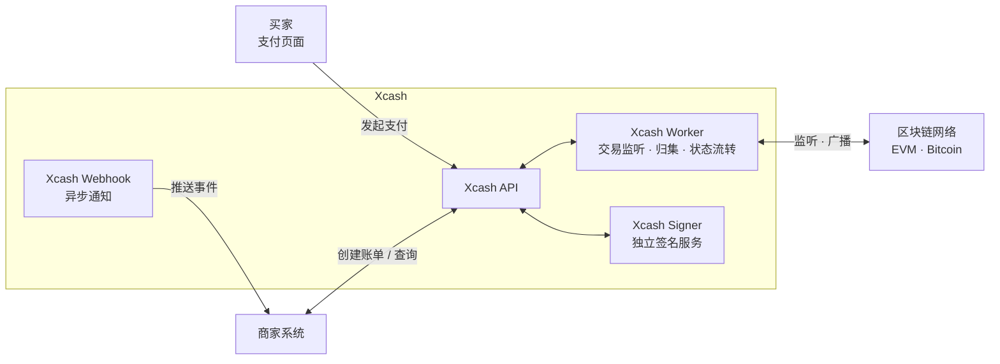

# Xcash

企业级开源加密货币支付网关 —— 专注链上价值流通

[](LICENSE)
[](https://www.python.org/)
[](https://www.djangoproject.com/)
[](https://www.postgresql.org/)
[](https://redis.io/)
[](https://react.dev/)

Xcash 是一个面向商家的加密货币金融基础设施。支持 EVM 兼容链和 Bitcoin、Tron 等，
提供 支付、充值、提币、自动归集等完整的加密货币金融网关能力。
完全自托管，资产安全永远是第一驱动力。

## 适用场景

- 电商、游戏、SaaS 等平台接入加密货币支付
- 交易所或钱包服务商需要充提币基础设施
- 跨境业务使用稳定币（USDT/USDC）进行结算
- 企业内部数字资产管理与链上资金调度

## 链支持

| 功能 | ETH | BTC | BNB Chain | Arbitrum | Base | Tron | Polygon | Avalanche | Optimism | 其他 EVM |
|:----:|:---:|:---:|:---------:|:--------:|:----:|:----:|:-------:|:---------:|:--------:|:--------:|
| 支付 | ✅ | ✅ | ✅ | ✅ | ✅ | ✅ | ✅ | ✅ | ✅ | ✅ |
| 充值 | ✅ | ❌ | ✅ | ✅ | ✅ | ❌ | ✅ | ✅ | ✅ | ✅ |
| 提币 | ✅ | ❌ | ✅ | ✅ | ✅ | ❌ | ✅ | ✅ | ✅ | ✅ |

> 所有 EVM 兼容链均可通过后台配置接入，无需额外开发。

## 代币支持

EVM 链支持任意 ERC-20 代币，只需在后台添加代币合约地址即可启用。
Tron 链当前仅支持支付功能，且仅支持 USDT。

## 截图


## 特性

- 🔗 **多链支持** — 支持所有 EVM 兼容链（Ethereum、BSC、Polygon 等）和 Bitcoin、Tron，更多链即将到来
- 💎 **资金直达** — 支付场景下，买家付款直接转入商户自己的钱包地址，资金全程不经过第三方，零信任风险
- 🔐 **完全自托管** — 基于 BIP44 HD 钱包派生地址，账户由你自己掌控，不依赖任何第三方托管
- 🚀 **一键部署** — 提供环境初始化脚本和 Docker Compose，几条命令即可启动完整服务
- 💰 **完整支付网关** — 支付收款、充值、提币、自动归集、Webhook 通知，覆盖加密货币收付款全链路
- 📊 **强大的管理后台** — 内置经营看板、多维度数据统计、开箱即用的运营管理能力，让你对业务全局一目了然

## 云服务

如果你不想自己部署和维护，可以直接使用官方托管版本：

👉 **[xca.sh](https://xca.sh)** — 开箱即用，免部署，持续更新

## 架构



## 快速开始

### 环境要求

- Docker 和 Docker Compose

### 1. 克隆项目

```bash
git clone https://github.com/xcash-team/xcash.git
cd xcash
```

### 2. 初始化环境变量

```bash
./scripts/init_env.sh
```

自动生成 `.env` 文件并填充所有必需的密钥（Django Secret、数据库密码、Signer 密钥等）。   
请妥善保存并保密此 `.env` 文件，如若丢失将失去系统内资产。

### 3. 设置访问方式（二选一）

#### 方式 A：域名访问（公网部署）

编辑 `.env` 设置 `SITE_DOMAIN` 为你的域名：

```env
SITE_DOMAIN=xcash.example.com
```

请确保该域名的 DNS 已解析到你的服务器 IP，并配置好反向代理（如 Nginx/Caddy）将流量转发至 `http://localhost:6688`，由反向代理处理 HTTPS 证书。启动后通过 `https://你的域名` 访问。

#### 方式 B：IP 访问（内网部署）

如果需要局域网内其他机器访问，设置为内网 IP，并开放 Traefik 监听地址：

```env
SITE_DOMAIN=10.0.0.5
LISTEN_TO=0.0.0.0
```

### 4. 启动服务

```bash
docker compose up -d
```

首次启动时，如果数据库内还没有任何管理员账号，系统会自动创建默认后台账号：

```text
username: admin
password: Admin@123456
```

首次登录后台后，系统会继续引导你绑定 OTP；完成登录后请立即修改默认密码。

### 5. 更新项目

拉取最新代码后重新构建镜像并重启容器。

```bash
git pull
docker compose up -d --build
```

## API 对接

部署完成后，参考 [API 对接文档](API.md) 接入支付、充币、提币和 Webhook 回调。

## 技术栈

- **后端**：Django 5.2 + Django REST Framework
- **任务队列**：Celery + Redis
- **数据库**：PostgreSQL
- **区块链交互**：web3.py（EVM）、bit（Bitcoin）
- **钱包派生**：BIP44 HD 钱包（bip-utils）
- **前端支付页**：React 19 + Vite + Tailwind CSS
- **部署**：Docker Compose

## 路线图

- [ ] Solana 链支持
- [x] TRON 链支持
- [ ] 完善文档站

## 商业支持

如果你在部署或使用过程中需要专业协助，欢迎联系我们获取技术支持服务。

📮 联系邮箱：tech@xca.sh

## 贡献

欢迎提交 Issue 和 Pull Request。

## License

[MIT](LICENSE)
